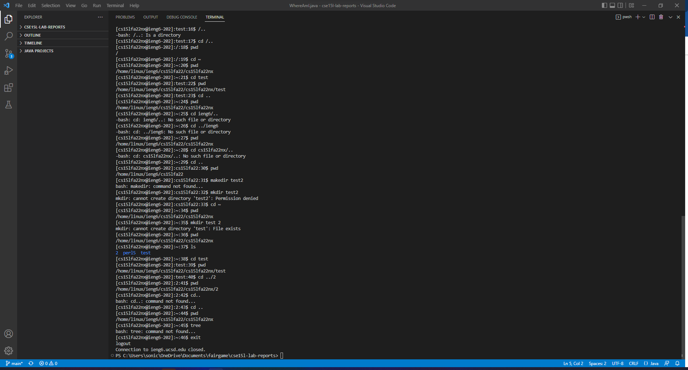

# Remote Server and Local Client Tutorial
* Installing *Visual Studio Code*:

    Before connecting to a remote server, we have to install a source-code-editor which allows us to type commands that will communicate with the remote server. For this lab, we will use *Visual Studio Code* which can be downloaded from the official [website](https://code.visualstudio.com/). 

    Once installed, your screen should look like this (although possibly in a different color):

    

* Remotely Connecting

    First, begin by ensuring *OpenSSH* is installed within the app settings of your operating system. Once Visual Studio Code is launched, you can start the terminal by selecting "new terminal" from the drop down labeled "Terminal" at the top. Alternatively, you can also press *Ctrl+Shift+`* to start up the terminal.

    After you have launched the terminal and recieved the necessary login details for the server (username, password), type in `ssh` followed by the login in credentials. 
    
    If done correctly, the terminal should look like this:

    

* Trying Some Commands

    It is important to get familiar with this new environment. Remember that a good rule of thumb is to begin with the "pwd" (Print Working Directory) and "ls" (List) commands in order to get a feel of what directory you are currently in as well as the contents of that directory. 

    Below is an example of some of the commands I have used to navigate the remote server:

    

* Moving files with `scp`
    
    Like `ssh`, `scp` is a command that allows the user to communicate with a remote server. However, a key difference is that instead of navigating the files of the server, users are able to copy local files from the client onto the server. The 

    ```
    scp <local file to be copied path> <server login credentials>:<server path copy will be saved>
    ```
    
    It is important to note that this does not keep the user logged into the server. This simply copies the file. 

    Below is an example of how `scp` works in the terminal by copying a java file from the client to the server, compiling, and then running the program:

    

* Setting an SSH Key

    One hinderance of both `ssh` and `scp` is that the user has to input a password every single time they wish to log in or make a file change. This makes for very inefficent workflow so it is very helpful so make what is called an *SSH Key*. What makes the SSH Key special is that it allows the user to bypass the password check by creating both a public key(to be stored on the server) and private key(to be stored on the client). 

    Below is a screenshot of the process used in order to create an SSH Key using a program called `ssh-keygen`:

    

    After the creation of these keys, it is important to copy the public key to the server as noted earlier. Make sure to create a folder titled .ssh and then on the server run the following code (using the specific client's path for the public key) in order to copy the necessary file:

    

    Lastly, if you are on a windows operating system, it is important to run the `ssh-agent` service and `ssh-add` in order to ensure that the key operates as it should each time the client is rebooted. Note that in order to do this, you **MUST** run PowerShell as an administrator and then type the following commands:

    

    The results of utilizing SSH Keys are immediately apparent. Before having the keys, changing, copying, and running code on a server took me about 1 minute and 53 seconds. After having the key, this was reduced to 1 minute and 11 seconds. Obviously the time will vary depending on how fast the user can type.

    Changing/running code *without* SSH Key:
    

    Changing/running code *with* SSH Key:
    

* Optimize Remote Running

    By utilizing some clever commands and thinking ahead, it is possible for the user to maximize their workflow. By chaining together commands and reusing previous lines of code by using the  key, it is possible to copy, compile, and run code quickly and efficiently.

    Below is an example of how to copy, compile, and run code using only two key strokes:

    