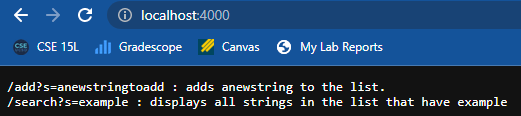
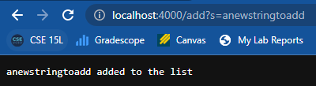
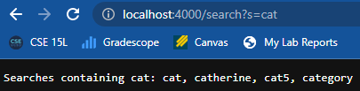
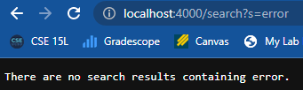
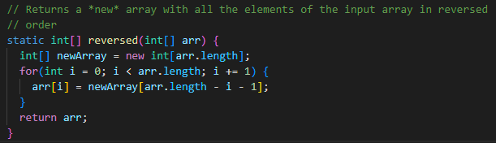
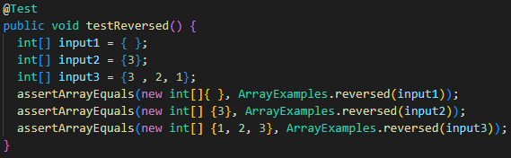
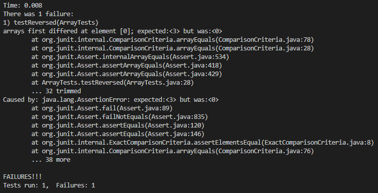
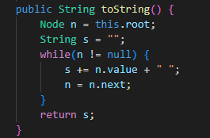
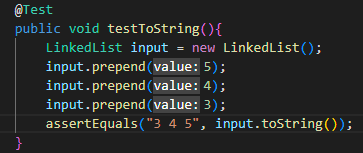
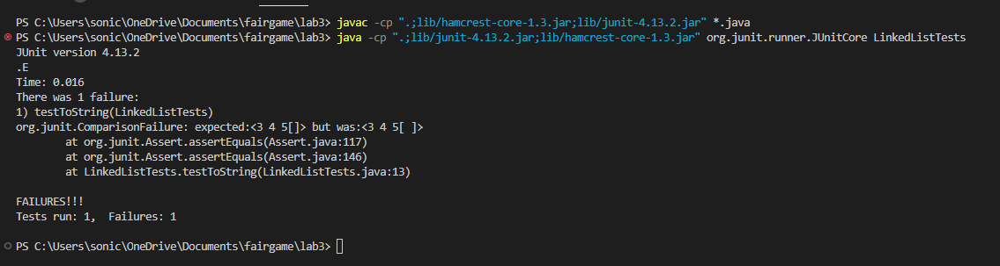

# Week 3 Lab Report

## **Part 1: A Simple Search Engine**

In this part of the lab, I coded a search engine that takes in strings, stores them, and then searches for the strings based on the information gathered from the URL. Below is the code that is used to run the website:

```
import java.io.IOException;
import java.net.URI;
import java.util.ArrayList;

class SearchHandler implements URLHandler {
    // The one bit of state on the server: a number that will be manipulated by
    // various requests.
    ArrayList<String> searches = new ArrayList<String>();

    public String handleRequest(URI url) {
        if (url.getPath().equals("/")) {
            return String.format("/add?s=anewstringtoadd : adds anewstring to the list.\n/search?s=example : displays all strings in the list that have example");
        } else if (url.getPath().equals("/add")) {
            String[] parameters = url.getQuery().split("=");
            if(parameters[0].equals("s")){
                searches.add(parameters[1]);
                return String.format("%s added to the list" , parameters[1]);
            }
            
        } else {
            System.out.println("Path: " + url.getPath());
            if (url.getPath().contains("/search")) {
                String[] parameters = url.getQuery().split("=");
                if (parameters[0].equals("s")) {
                    if(searches.size() == 0) return "There are no searches containing " + parameters[1] + ".";
                    String s = "";
                    for(int i = 0; i < searches.size(); i++){
                        if(searches.get(i).contains(parameters[1])) s += searches.get(i) + ", "; 
                    }
                    if(s.equals("")) return "There are no search results containing " + parameters[1] + ".";
                    return "Searches containing " + parameters[1] + ": " + s.substring(0, s.length() - 2);
                }
            }
        }
        return "404 Not Found!";
    }
}

class SearchEngine {
    public static void main(String[] args) throws IOException {
        if(args.length == 0){
            System.out.println("Missing port number! Try any number between 1024 to 49151");
            return;
        }

        int port = Integer.parseInt(args[0]);

        Server.start(port, new SearchHandler());
    }
}
```

In this code, I used an `ArrayList` to store all the searches that were gather in by the URL. I then used additional data gathered from the URL to determine whether or not I am adding a string, or searching for particular results. This will be explained in further detail down below.

## Homepage:



This is what is displayed when you access the homepage. As you can see, the possible commands are displayed so that the user knows what commands are possible. In the code, this is done by checking if the current URL is in the domain in the first if statement. More specifically, it checks if the current path is `"/"` by invoking `url.getPath().equals("/")`. Below we will see some possibilities that can happen if that path is changed.

## Add:



When adding a new string to the list, the program check to see if the URL contains `/add` by invoking the `.contains("/add")` method. Then, it grabs the query using the `url.getQuery()` method and makes an array that splits the query byt using `.split("=");` The reason for this is to get more info from the query. If the first part of the query contains an "s," then from there, the program knows the user is trying to add a string so it adds the second part of the query to the `ArrayList`. The program then lets the user know that the string was added.

## Search:


The last command that can be given to the program is search. To do this, the program checks if the URL contains `/search` by invoking the `.contains("/search")` method. If it does, the program then splits the query again by invoking `url.getQuery()`. It then splits the query in two by invoking the `.split("=")` method. Like with add, this is to check to see if the query begins with an "s." If it does, then the second part of the query is what will be searched. Above is an example of the output.

## Possible Errors:

 

Some possibilities of errors include a nonexistent path as well as searching for a string that is not in the list. If a nonexistent path is in the URL, the program displays a 404 error but on the other hand, if the ArrayList is empty or there are no strings containing the search term, the program will simply state that there are no such elements.

---
## **Part 2: Debugging**

Now I would like to talk about two errors I found while debugging some code. In order to do this, I want to talk about the failure-inducing inputs, the symptoms, the bug, and why it is that the bugs caused those symptoms. 

## Test 1:







* The failure inducing input is the array containg {3} (although this will fail for all arrays of size one or greater).

* The symptom is that the method is returning an unexpected array. It should be reversed but instead, the array changed the values altogether.

* The bug is that the old array is being assigned the values from the new array. It then returns the old array. This means that the old array is being overwritten by an array containing nothing but 0.

* The bug causes this symptom because instead of returning an array which has reversed elements, it assigns each element of the array to be 0.

## Test 2:






* The failure inducing input in this case is all linked lists with at least one element

* The symptom is that toString() returns one extra space.

* The bug is that the s string is returned without deleting the extra space.

* This bug causes that symptom because the string is returned with an extra space. This could be fixed by returning `s.substring(0, s.length() - 1)` instead.

