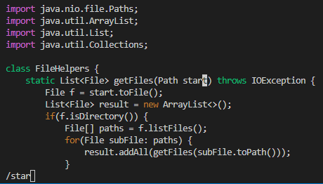
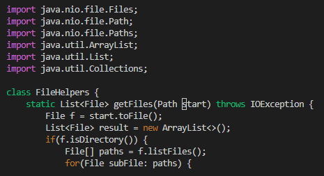
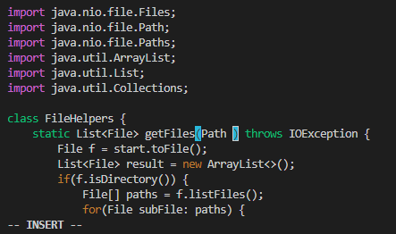
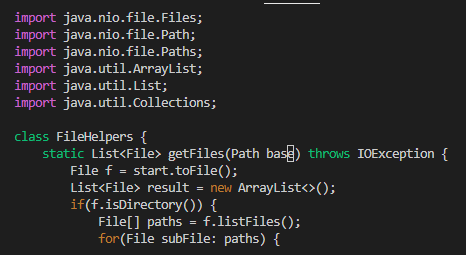
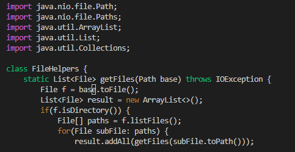
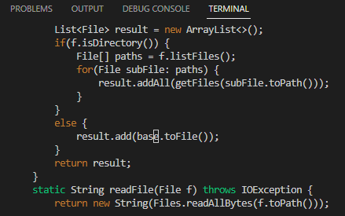

# Week 7 Lab Report

## Part 1: Changing a Parameter in 22 Keystrokes

The goal of this demonstration is to change a parameter and all instances of that parameter in as few keystrokes as possible. The parameter in question is the one called `start`. I will change it so that it is called `base`.

Key presses: `/star<enter><n><c><e>base<esc><n><.><n><.><esc><:><w><q>`

* Search for `start`.

Full key presses in this step: `/star<enter>`

By typing `/star` and then `<enter>` we are able to highlight the text. So far that is 6 keystrokes.

* Changing `start` to `base`

`<n>`

`<c><e>`

`base<esc>`

All key presses in this step: `<n><c><e>base<esc>`

Total key presses: `</>star<enter><n><c><e>base<esc>`

By pressing `n` we are able to go to our first instance of `start`. Then by pressing `ce` we are able to delete the word and enter insert mode in order to change the word. After that, type in `base` followed by the `<esc>` key to finish changing the word. So far, this is 14 keystrokes.

* Change every instance of `start`.

`<n><.>`

`<n><.><esc>:wq`

All key presses in this step: `<n><.><n><.><esc><:><w><q>`

Total key presses: `/star<enter><n><c><e>base<esc><n><.><n><.><esc><:><w><q>`

By pressing the `n` key, we can skip to the next instance of `start`. After that, we can use the `<.>` key in order to repeat our last command which in this case was to change `start` to `base`. Repeat this until all instances of `start` are notw `base`. Then, press `<esc>:wq` in order to quit and save. This entire process took 22 keystrokes.

# Part 2: 

* Would I rather work in Visual Studio Code or Vim for a program that I am working on remotely?

If I were editing a program remotely, then it really depends on the type of edit I am working on. If the program required small edits such as what was shown in part 1, then Vim is definitely the way to go. It could be a hassle to constantly `scp` edit changes over and over again in order to test my new code. When testing, I was able to make an edit and test the code through Vim in about 45 seconds while uploading through `scp` took me about a minute and a half. 

* Are they any factors that would change my mind?

Certain project qualities could influence my decision. For instance, Visual Studio Code and most other IDEs have quality of life features that make programming easier when compared to Vim. If I were working on a very large project from scratch, then I would more likely you Visual Studio Code. However, if I needed to make a small change, then Vim is the way to go.