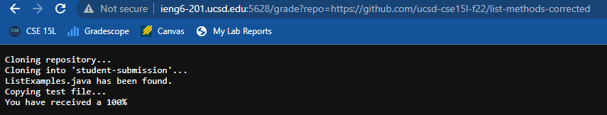
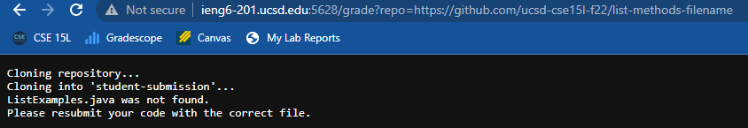
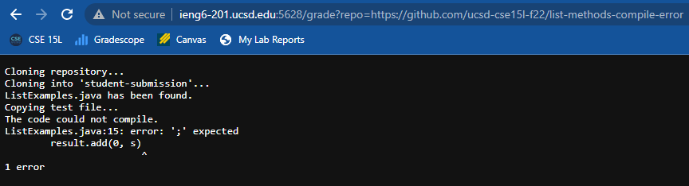

# Auto-Grader
For this lab report, I have written a bash script that will grade a student's code. Here is the script I have written:

```
FILE="ListExamples.java"
CPATH=".:lib/hamcrest-core-1.3.jar:lib/junit-4.13.2.jar"
rm -rf student-submission
echo "Cloning repository..."
git clone $1 student-submission
cd student-submission
if [[ -f "$FILE" ]]
then
        echo "$FILE has been found."
else
        echo "$FILE was not found."
        echo "Please resubmit your code with the correct file."
        exit 1
fi
cd ../
echo "Copying test file..."
cp TestListExamples.java student-submission/
cp -r lib student-submission/
cd student-submission/
javac -cp $CPATH *.java 2> error.txt
if [[ $? -ne 0 ]]
then
        echo "The code could not compile."
        cat error.txt
        exit 1
fi
java -cp $CPATH org.junit.runner.JUnitCore TestListExamples | grep "Tests run:" > results.txt
NUMS=(`grep -o '[0-9]' results.txt`)
PASS=${NUMS[0]}

if [[ 2 -eq $PASS ]]
then
        echo "You have received a 0%"
fi

if [[ 1 -eq $PASS ]]
then
        echo "You have received a 50%"
fi

if [[ 0 -eq $PASS ]]
then
        echo "You have received a 100%"
fi
cat results.txt
```

Below are three screenshots of this script running through a remote server. I will trace the final screenshot/

## Code receiving 100%:


## File Not Found:


## Compile Error:


## Trace of the Last Image:

```
FILE="ListExamples.java" #Error code - 0
CPATH=".:lib/hamcrest-core-1.3.jar:lib/junit-4.13.2.jar" #Error code - 0
rm -rf student-submission #Error code - 0
echo "Cloning repository..." #Error code - 0
git clone $1 student-submission #Error code - 0
cd student-submission #Error code - 0
if [[ -f "$FILE" ]] #True because the file was found, error code 0
then
        echo "$FILE has been found." #Because it is true, this command runs.
else
        echo "$FILE was not found." #This command does not get run
        echo "Please resubmit your code with the correct file." #This command does not get run.
        exit 1 #This command does not get run.
fi 
cd ../ #Error code - 0
echo "Copying test file..." #Error code - 0
cp TestListExamples.java student-submission/ #Error code - 0
cp -r lib student-submission/ #Error code - 0
cd student-submission/ #Error code - 0
javac -cp $CPATH *.java 2> error.txt #Error code nonzero and the stderr prints the details of the copilation error. This then gets written into a .txt file.
if [[ $? -ne 0 ]] #This is true because the error code is nonzero. After this, the error code is 0 once again.
then
        echo "The code could not compile." #Error code - 0
        cat error.txt #Error code - 0
        exit 1 #Error code is now 1
fi

#The rest of the commands do not run.

java -cp $CPATH org.junit.runner.JUnitCore TestListExamples | grep "Tests run:" > results.txt
NUMS=(`grep -o '[0-9]' results.txt`)
PASS=${NUMS[0]}

if [[ 2 -eq $PASS ]]
then
        echo "You have received a 0%"
fi

if [[ 1 -eq $PASS ]]
then
        echo "You have received a 50%"
fi

if [[ 0 -eq $PASS ]]
then
        echo "You have received a 100%"
fi
cat results.txt
```